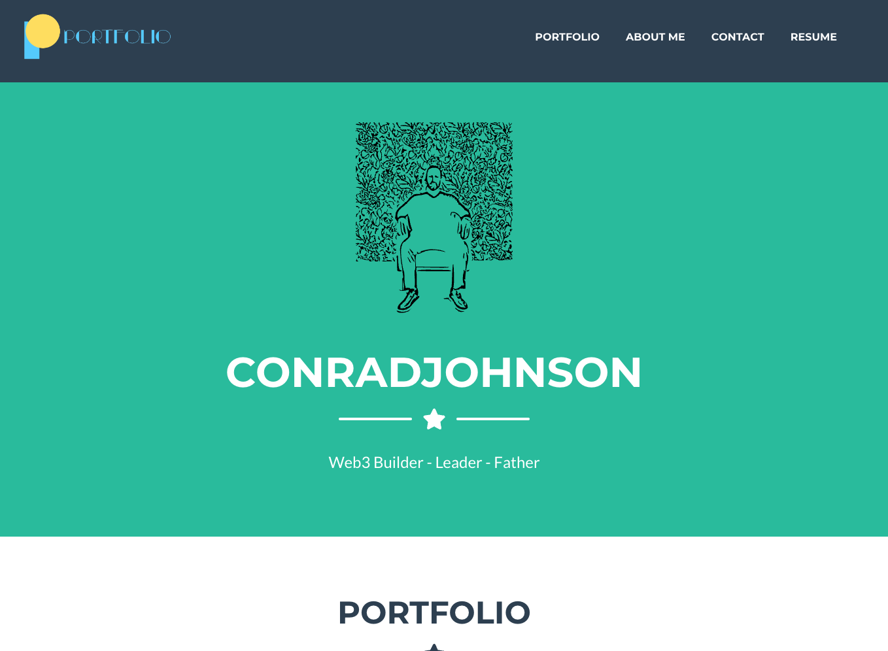

 
 

#  Portfolio built with React

## Description

Portfolio build with React uses a react front end to display work for a developer.  It uses dynamically rendered REACT components for the contact form for input formatting, and traditional bootstrap modals, delivered via react component.  It uses the [Freelancer - Start Bootstrap Theme](https://startbootstrap.com/theme/freelancer) - HTML and Bootstrap styling - provided by [StartBoostrap.com](https://startbootstrap.com/).  It also uses a custom generated SVG for logo.

## Table of Contents

- [Demo and Screen Shots](#demo)
- [Installation](#installation)
- [Usage](#usage)
- [Credits](#credits)
- [License](#license)
- [Questions](#questions)

## Demo
***

Demo:

[Demo Link](https://conradjohnson.github.io/portfolio-react/)

Screen Shot:

## Installation
***

git clone, npm install, npm run build

## Usage
***

npm run start on local machine or npm run deploy to deploy to github pages.

## Credits
 ***

[conradjohnson](https://github.com/conradjohnson)

 ## License
 ***

  Apache License
  Version 2.0, January 2004

  [http://www.apache.org/licenses/LICENSE-2.0](http://www.apache.org/licenses/LICENSE-2.0)
  
  Copyright (c) 2022 James Johnson
  
  
          

# Questions
***
For questions or assistance, please contact through [GitHub Account](https://github.com/conradjohnson) or email: [notmyemail@gmail.com](mailto:notmyemail@gmail.com)

 [Back to top](#description)
